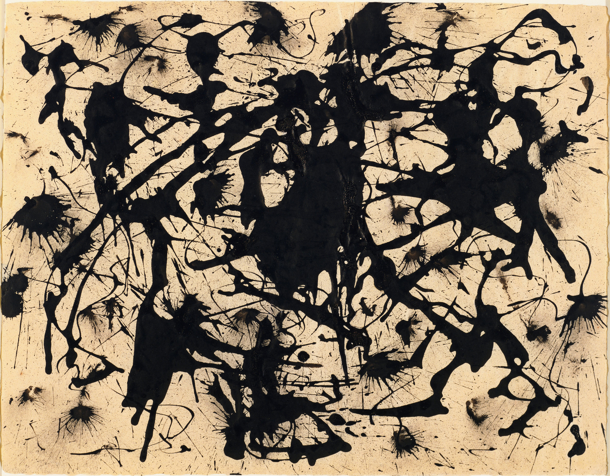

Anything that anyone says is art is art. I will get that out of the way so that there’s no vaguary about the position of this article.

First, (and most importantly) it’s incredibly boring to debate whether something is art or not. I think, like, if you’re going to start having the debate about the art-worthiness of something there is going to be:

1. A debate about the specific aspects of a piece that make a piece artworthy, 
2. A deeper dive into a person’s “tastes” (which is code for their biases) and subjective preferences based on the individual’s experiences, 
3. And worst of all, another, longer conversation about what art is and isn’t (which takes us back to item 2) in a circular manner until no one is satisfied with any definition.

This conversation is truly endless and entirely subjective - it’s like debating a dream, that only you had, compared to a dream that only someone else had. The individual reality you have experienced is likely separate from every other person’s and one of the good things about art is that we all experience works of art in the black box of our minds.

Some common takes on art-worthiness include a preconceived notion about accepted mediums (such as painting, sculpture, or film), historical opinions (art history or group think), the most common one, amount of labor expended to create the work, and aesthetics from a purely subjective stance (as if there were another possible stance in a post-modern world),

## On Accepted Mediums

This should be quick. If you think that only painting/sculpture are art, I think you should really expand your personal experiences to include other mediums and media. This is not me arguing anything, I just think if you can get used to experiencing media in new formats on an annual basis on digital screens, you can experience novel and conceptual pieces of art as well. Your life will be much richer for it. 

Sometimes these works can be uncomfortable or you may not have seen enough of a type of media to understand the underlying language/messages in that media, but there is value in expanding your understanding of what art can be. If you never watched a Disney Princess movie and then watched, like, Frozen some of the implied messages and motivations may not be clear to you. It’s the same with video art or performance art, sometimes there is an underlying language you have not yet accessed.

## Historical Opinions

Even using terms like “outsider art” or “folk art” or “native art” are bad. It’s useful to have taxonomies but let’s be honest, these terms are meant to implement a class system which reflects the politically dominant group at the time of creation. And when I say “politically dominant” I am referring to colonialists, slave owners, zealots, monarchists, murders, war kings, and more groups/individuals along those lines. 

Even if there were, hypothetically, a benevolent ruling class - that ruling class would not reflect both the past and future concepts of what is art. This brings us to the topic of art history - the gatekeeper of art worthiness.

Art history is extremely interesting and allows us to learn about works of art through the lens of incredibly thoughtful, intelligent people. Art history is equally important to all other forms of history because it gives us information about our past, our progress, and often provides concrete evidence of times in human history that cannot be otherwise confirmed. 

But let’s be honest with ourselves, art history is selected by the politically dominant group at any given period of time and is so rife with bias that it actively erases other cultures, ideas, and cultural history.

I am not asking you to believe that we will one day have an all encompassing utopic world of universal acceptance, but since the bar I am setting is “just let everything be considered art” I think you can acknowledge the fact that having an institution determine whether a work can be considered art will inevitably reveal the bias of times and often reflect an underlying violence that has occurred/is occurring. 

This paragraph is mostly pointed at museums.

## Amount of Labor Expended

Let’s chat about Jackson Pollock - everyone’ favorite punching bag. “My five year old could have painted that” is a good one. “It’s just blobs of paint” is another one. There are two general rebuttals to the Jackson Pollock hate:

1. Well, you could have done it but you didn’t and at the time you also never would have thought to do it,
2. Some description of the work through a strict modernist lens which reveals the work to be both visually and conceptually strong.

I support both of these takes but I don’t support people giving these takes arrogantly (though, if arrogance is what turns you off of art don’t blame the art blame the arrogant people).

Pollock’s work is the sum of a lifetime of experience exploring visual language (lots of labor), a new idea (damn near impossible in any era), and a work that is visually stimulating (stand in front of one for a few minutes and you will understand the work better - I promise). 

I will spare you the deep dive into other people’s favorite labor-based art-worthiness arguments (Dada, graffiti, found object art) but really the only true requirement for something to be considered art is for something to be considered art - calculating labor has never been a requirement, even in the most conservative view of art-worthiness.

## Aesthetics

Hmm… I just want to say that if you think something isn’t art because you don’t like it, you’re merely stating your preference. This doesn’t have to apply to other people who have different preferences for you to maintain your preference. Thinking about why something is “good art” or “bad art” is the discussion we should be having.

Note the quotes because I am not personally ready to apply these terms to art but, again, that’s my preference - I prefer calling art shitty/lazy/dumb or beautiful/amazing/smart.

## If Everything Is Art, Then What?

Well, outside of copyright law, there isn’t really any effect to art where everything can be considered art. It doesn’t hurt anyone and if the work is so unpopular and deemed so unworthy it will probably disintegrate into dust faster than it would have otherwise. 

The advantages, however, are much greater.

1. No one has to have boring ass conversations about what is and is not art. 
2. It allows works that may not be seen as valuable to a present day majority group of people to continue to exist in some format absent erasure for future generations,
3. It allows us to expand our understanding of aesthetics, conceptual works, the world around us, and other cultures/subcultures in a dignified way,
4. An individual or group is allowed to freely express themselves creatively without fear of being mocked or derided for their “non-conformist” viewpoints.

## In Conclusion

Discussions of art-worthiness are almost always done in bad faith. It is at best gatekeeping and at worst reflective of some personal bias. Most importantly, it’s always boring so to answer your question, yes, this article is art.
